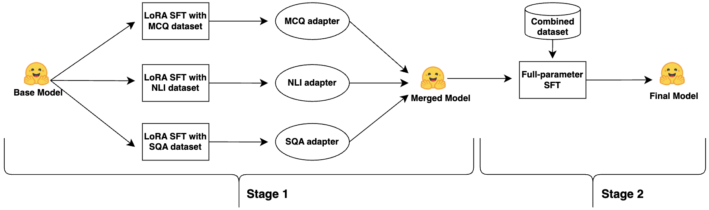

# A Two-Stage LoRA-to-Full Fine-tuning Approach for Vietnamese Legal Small Language Models

This repository contains the implementation and experimental results for **Project 1**, focusing on a **two-stage training framework** for Vietnamese legal small language models (≤ 4B parameters).  
The project is inspired by and adapted from the MinLegal approach proposed for the **VLSP 2025 LegalSLM Challenge**, and reimplemented within the scope of an academic course project.

---

## 📌 Project Overview

Training effective language models for Vietnamese legal reasoning is challenging due to:

- Limited labeled legal datasets  
- High linguistic and logical complexity of legal texts  
- Constrained computational resources  

To address these issues, this project proposes a **two-stage training strategy**:

1. **Stage 1 – Task-Specific LoRA Fine-tuning**  
   Independent LoRA adapters are trained for each legal task.
2. **Stage 2 – Full Parameter Multi-task Fine-tuning**  
   After merging the adapters, the entire model is fine-tuned to achieve global consistency and better generalization.

This approach demonstrates **clear performance improvements** compared to LoRA-only, QLoRA-only, and full fine-tuning baselines.

---

## ⚖️ Legal Reasoning Tasks

The model is trained and evaluated on **three Vietnamese legal NLP tasks**:

| Task | Description |
|-----|-------------|
| **MCQ** | Multiple-choice legal question answering (factual legal knowledge) |
| **NLI** | Legal citation usefulness classification (Yes/No inference) |
| **SQA** | Syllogistic legal reasoning with free-text justification |

---

## 🧠 Methodology

### Stage 1: Task-Specific LoRA Training
- Train **separate LoRA adapters** for MCQ, NLI, and SQA
- Best checkpoint selected individually for each task
- Adapters merged using **TIES + SVD (ties_svd)** to:
  - Resolve conflicting update directions
  - Preserve dominant parameter subspaces
  - Maintain low-rank efficiency

### Stage 2: Full Fine-tuning
- Merge LoRA updates into base model weights
- Remove adapters and fine-tune **all parameters**
- Multi-task training with a unified NLL loss

This design allows the model to:
- Retain task-specific knowledge
- Rebalance representations globally
- Improve robustness in multi-task settings

---

## 📊 Dataset

The training data is based on a **synthetically augmented Vietnamese legal dataset** released by the MinLegal authors.

| Task | Train | Test (Public) |
|----|------|---------------|
| MCQ | 803 | 146 |
| NLI | 745 | 150 |
| SQA | 1989 | 144 |
| **Total** | **3537** | **440** |

- Data format: **ShareGPT-style conversations**
- Dataset source: https://huggingface.co/datasets/vohuutridung/Vietnamese-Legal-Chat-Dataset

---

## 📈 Results

### Performance Comparison (Public Test)

| Method | MCQ (%) | NLI (%) | SQA (%) | Avg (%) |
|------|--------|--------|--------|--------|
| **Two-stage (Ours)** | 85.62 | **94.00** | 57.01 | **78.88** |
| LoRA-only | **87.67** | 77.33 | 57.85 | 74.28 |
| Full FT | 82.88 | 78.67 | **60.21** | 73.92 |
| QLoRA-only | 78.08 | 66.67 | 58.40 | 67.72 |

The two-stage framework achieves the **highest average score**, confirming the benefit of combining adapter merging with full fine-tuning.

---

## 📄 Full Report

A detailed technical report describing the **motivation, methodology, training procedure, and full experimental analysis** is included in this repository.

Readers interested in implementation details, ablation studies, and deeper discussions are encouraged to consult the full report.

---

## 📌 Notes

This repository is created for **academic and research purposes** within the scope of the *Project 1* course.  
Feedback and suggestions are welcome.
